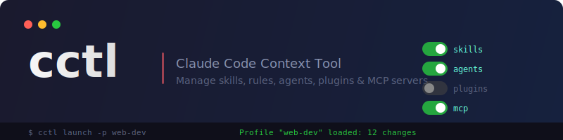

<p align="center">
  
</p>

<p align="center">
  <strong>TUI and CLI for managing Claude Code context</strong><br>
  Toggle skills, rules, agents, plugins, and MCP servers. Save profiles. Switch contexts instantly.
</p>

<p align="center">
  <a href="#install">Install</a> ·
  <a href="#quick-start">Quick Start</a> ·
  <a href="docs/cli.md">CLI Reference</a> ·
  <a href="docs/tui.md">TUI Guide</a> ·
  <a href="docs/profiles.md">Profiles</a> ·
  <a href="docs/architecture.md">Architecture</a>
</p>

---

## Why

Claude Code loads everything in `~/.claude/` — every skill, rule, agent, plugin, and MCP server. On a large setup this burns context window tokens on things irrelevant to your current project.

cctl lets you curate what's active:

| Context | What you enable |
|---------|----------------|
| **Web project** | frontend skills, TypeScript agents, Playwright MCP |
| **Go CLI project** | Go patterns, Go reviewers, gopls LSP |
| **Research** | Obsidian MCP, Zotero, paper-writing skills |

Save a profile, switch projects, restore in one command.

## Install

### Download binary

Grab the latest release for your platform from [Releases](https://github.com/Gauravism2017/cctl/releases):

```bash
# macOS (Apple Silicon)
curl -Lo cctl.tar.gz https://github.com/Gauravism2017/cctl/releases/latest/download/cctl_$(curl -s https://api.github.com/repos/Gauravism2017/cctl/releases/latest | grep tag_name | cut -d'"' -f4 | tr -d v)_darwin_arm64.tar.gz
tar xzf cctl.tar.gz && mv cctl ~/.local/bin/ && rm cctl.tar.gz

# Linux (amd64)
curl -Lo cctl.tar.gz https://github.com/Gauravism2017/cctl/releases/latest/download/cctl_$(curl -s https://api.github.com/repos/Gauravism2017/cctl/releases/latest | grep tag_name | cut -d'"' -f4 | tr -d v)_linux_amd64.tar.gz
tar xzf cctl.tar.gz && mv cctl ~/.local/bin/ && rm cctl.tar.gz
```

### Build from source

**Prerequisites:** Go 1.21+

```bash
git clone https://github.com/Gauravism2017/cctl.git
cd cctl
make install
```

Builds the binary and copies it to `~/.local/bin/cctl`. Ensure `~/.local/bin` is in your `PATH`.

## Quick Start

```bash
# Launch the interactive TUI
cctl

# Save your current setup as a profile
cctl profile save my-project

# Bind it to a project directory
cd ~/my-project
cctl init my-project

# Launch Claude Code with the profile loaded
cctl launch
```

## Features

**Interactive TUI** — Browse and toggle all item types across tabbed views. Filter, bulk enable/disable, and save changes.

**Profiles** — Snapshot enabled state of all items. Load a profile to restore your setup. [Full guide →](docs/profiles.md)

**Per-project binding** — Bind profiles to directories with `cctl init`. Run `cctl launch` to load and start Claude Code.

**Multi-profile directories** — Monorepos can bind multiple profiles. An interactive picker appears at launch:

```
Select profile:
  ▸ frontend
    backend
    data-pipeline
```

**Direct launch** — Skip binding entirely with `cctl launch -p <name>`.

**Symlink store** — Items are never deleted. Enable creates a symlink, disable removes it. [Architecture →](docs/architecture.md)

**Shell completions** — Built-in for Bash, Zsh, Fish, and PowerShell.

## Commands

```
cctl                              Launch TUI
cctl launch [-p <profile>]        Load profile + start Claude Code
cctl init <profile>               Bind profile to current directory
cctl init --remove <profile>      Unbind profile
cctl profile save <name>          Save current state
cctl profile load <name>          Load a profile
cctl profile list                 List profiles
cctl profile delete <name>        Delete a profile
cctl migrate                      Migrate from vault to symlink store
```

[Full CLI reference →](docs/cli.md)

## Documentation

| Document | Contents |
|----------|----------|
| [CLI Reference](docs/cli.md) | All commands, flags, shell completions, shell wrapper |
| [TUI Guide](docs/tui.md) | Keybindings, tabs, profile editing |
| [Profiles](docs/profiles.md) | Save/load, per-project, multi-profile, examples |
| [Architecture](docs/architecture.md) | Symlink store, item types, auto-adoption, migration |
| [Development](docs/development.md) | Building, project structure, contributing |

## License

MIT
